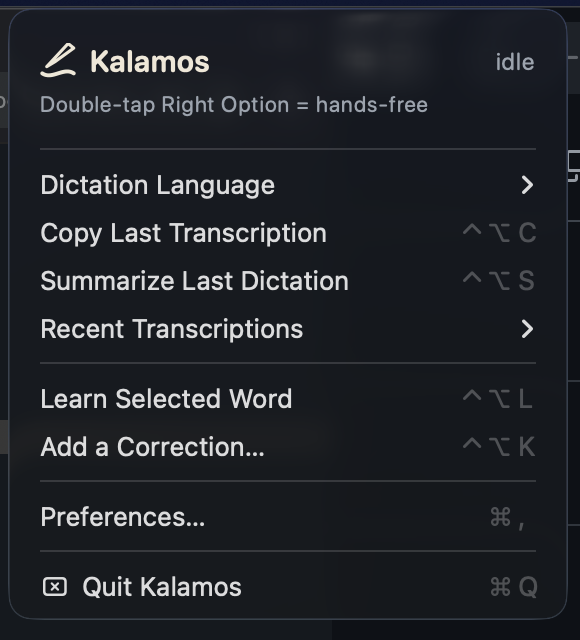
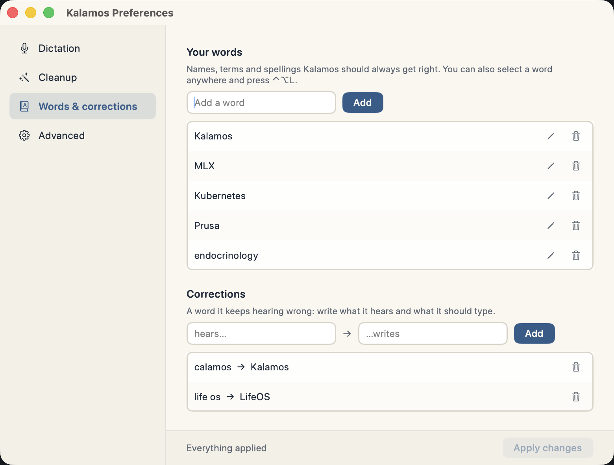

<div align="center">
  <h1>Kalamos</h1>
  <p><strong>Local-only dictation for macOS that writes like you meant it, and checks the model's work against what you actually said.</strong></p>
  
</div>

<p align="center">
  <a href="https://github.com/xmasyx/kalamos/releases/latest"></a>
  
  
  
  <a href="LICENSE"></a>
</p>

Hold a key, speak, release. Punctuated, cleaned-up text lands at your cursor, in
whatever app you are using. Both models, the one that hears you and the one that
tidies what you said, run on your Mac.

```
you say:  the meeting is on tuesday at ten no wait wednesday at ten thirty in the big room
you get:  The meeting is on Wednesday at ten thirty in the big room.

you say:  so basically um the api returns a list of users and uh each one has an id
          a name and an email and then you filter them by the active flag before
          you render them
you get:  So basically, the API returns a list of users, and each one has an ID, a
          name, and an email. Then you filter them by the active flag before you
          render them.
```

Tuesday at ten is *gone*, not punctuated into the sentence. The fillers dropped,
"api" became "API", one breathless run-on became two sentences. Every example in
this repository is real output, and you can reproduce any of them:

```sh
Kalamos --clean "the meeting is on tuesday at ten no wait wednesday at ten thirty"
```

## Install

```sh
curl -fsSL https://raw.githubusercontent.com/xmasyx/kalamos/main/Scripts/install.sh | bash
```

Requires **macOS 14+ on Apple Silicon** (M1 or newer): transcription runs on the
Neural Engine, which Intel Macs do not have. Builds are unsigned, so the installer
clears the quarantine flag — read the script first, and see
[what macOS will say and why](docs/using-it.md#what-macos-will-say-and-why).

Removing it: `install.sh --uninstall`, or `--purge` to take the downloaded models
and settings with it.

## What it does

**It checks its own output.** The dangerous failure of a cleanup model is not a
typo, it is the sentence that comes back reading better while meaning something
else: a dropped condition, a missing "not", a rounded number. Those get refused
rather than typed. No other dictation app does this, and it is the reason this one
exists — [the whole argument, with the failure cases](docs/why.md).

**It resolves what you take back mid-sentence.** *"We should ship on Friday, I mean
Monday, because Friday is a public holiday"* becomes **"We should ship on Monday
because Friday is a public holiday."** The wrong day goes, the reason for it
survives. Works the same in Italian and French.

**It learns your words, two ways.** A word misheard the same way every time is a
correction, applied to the raw transcript before anything else. A term mangled
differently every time is vocabulary, weighed in context by the model. Select a
word anywhere on your Mac and press ⌃⌥L to teach it without opening a window.



**It rewrites text you already have.** Select any text, hold the edit key, say how
to change it, and it is rewritten in place. **It translates on device**: dictate in
Italian and get English at the cursor, same model, nothing leaves the Mac.

**And it fits the Mac you own.** First run reads the chip, the memory, the cores
and the free disk, then proposes the models that fit and shows you the figure that
decided each choice. Accept and setup is two pages shorter.


## Privacy, and how to check it rather than believe it

There is no cloud path here. No account, no API key field, no cloud toggle, no
server to point at. The single outbound request in the app's life is the model
download on first run; after that it works with the network off.

*Local-first* is the polite way of saying a cloud path exists and you are not using
it today. This is **local-only**, and you can prove it yourself with one grep:
[verifying the privacy claim](docs/privacy.md). What touches your disk, precisely,
is in [what this project commits to](docs/commitments.md).

## Engines and models

Three speech engines, switchable in Preferences, all on device.

| Engine | What it runs | Pick it when |
|---|---|---|
| **Whisper.cpp** (default) | large-v3-turbo, 1.62 GB | you want the app to learn your words, and the same audio to give the same text every time |
| **Whisper** (WhisperKit, Core ML) | four model sizes from a menu | you want to change model size, or a smaller download |
| **Parakeet** (FluidAudio) | one model, 461 MB | you want the smallest download and the fastest answer |

Which cleanup model your Mac can hold, why whisper.cpp became the default, and the
measurements behind both: [engines and models](docs/engines-and-models.md).

## Documentation

- [Using it](docs/using-it.md) — the trigger, Edit Mode, spoken punctuation, translation, nothing is ever lost, troubleshooting
- [Why it exists](docs/why.md) — the crowded shelf, the net under the model, and what is deliberately not here
- [Engines and models](docs/engines-and-models.md) — the three engines with numbers, and what your Mac can run
- [Privacy](docs/privacy.md) — check the claim yourself
- [What it commits to](docs/commitments.md) — enforced by code or checkable by you
- [Architecture](docs/architecture.md) — how it is put together

## Build from source

```sh
git clone https://github.com/xmasyx/kalamos.git && cd kalamos
./Scripts/build-app.sh
```

Needs full Xcode: the Metal shader compiler for MLX ships with it and not with the
Command Line Tools.

## Status

Working, and used daily by its author. Not code-signed or notarized, hence the
quarantine step. Three interface languages so far; adding one is mostly a matter of
teaching it that language's Whisper hallucinations and self-correction markers.

Bug reports and pull requests are welcome. For a cleanup problem, attach the
`--doctor` output and what you said versus what you got.

## Credits

Built on [whisper.cpp](https://github.com/ggml-org/whisper.cpp) and
[WhisperKit](https://github.com/argmaxinc/WhisperKit) for on-device speech, and
[MLX](https://github.com/ml-explore/mlx-swift-examples) for the on-device language
model. None of those projects are affiliated with this one.

## License

MIT — see [LICENSE](LICENSE).
