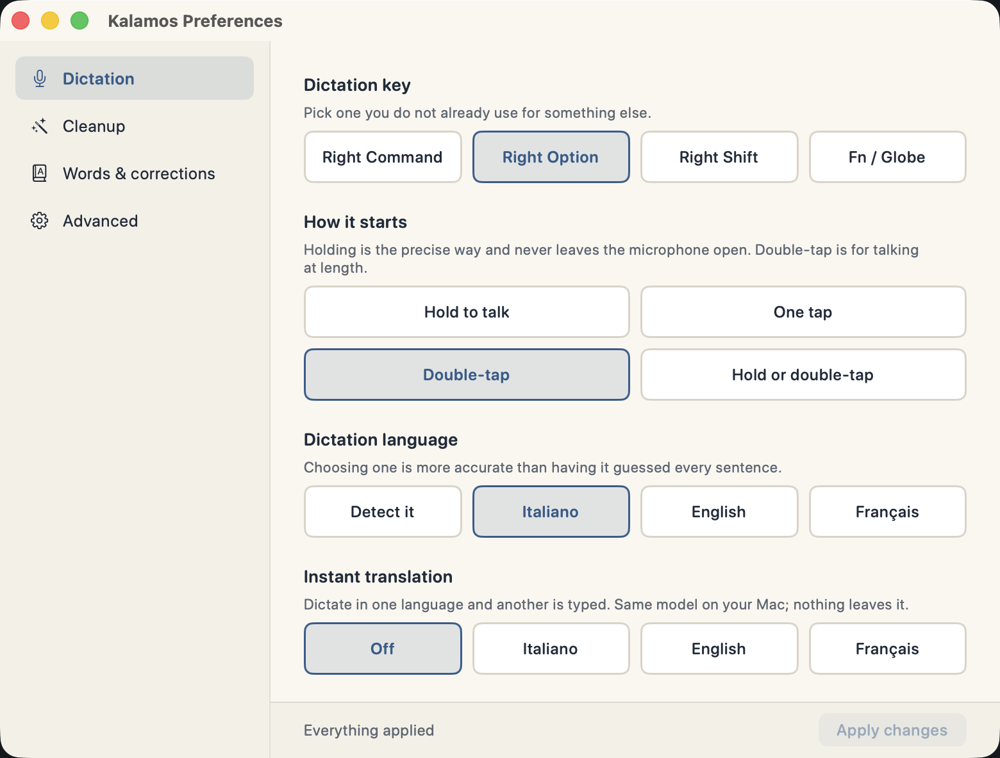
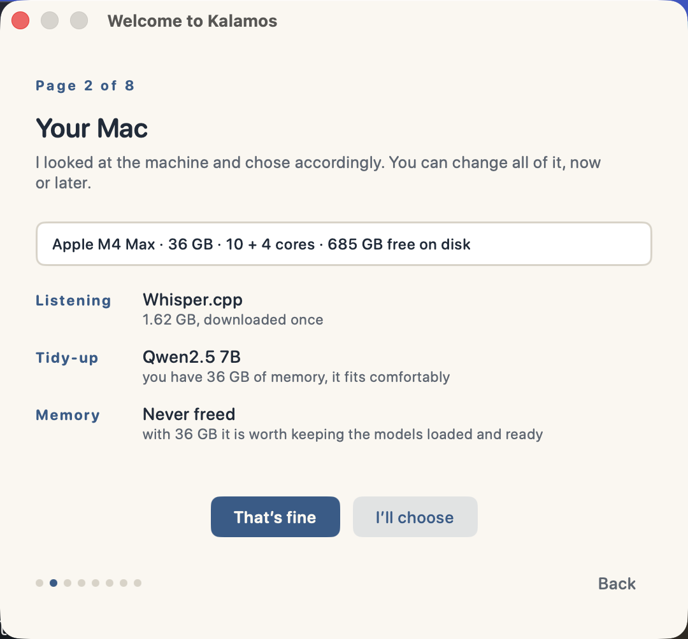
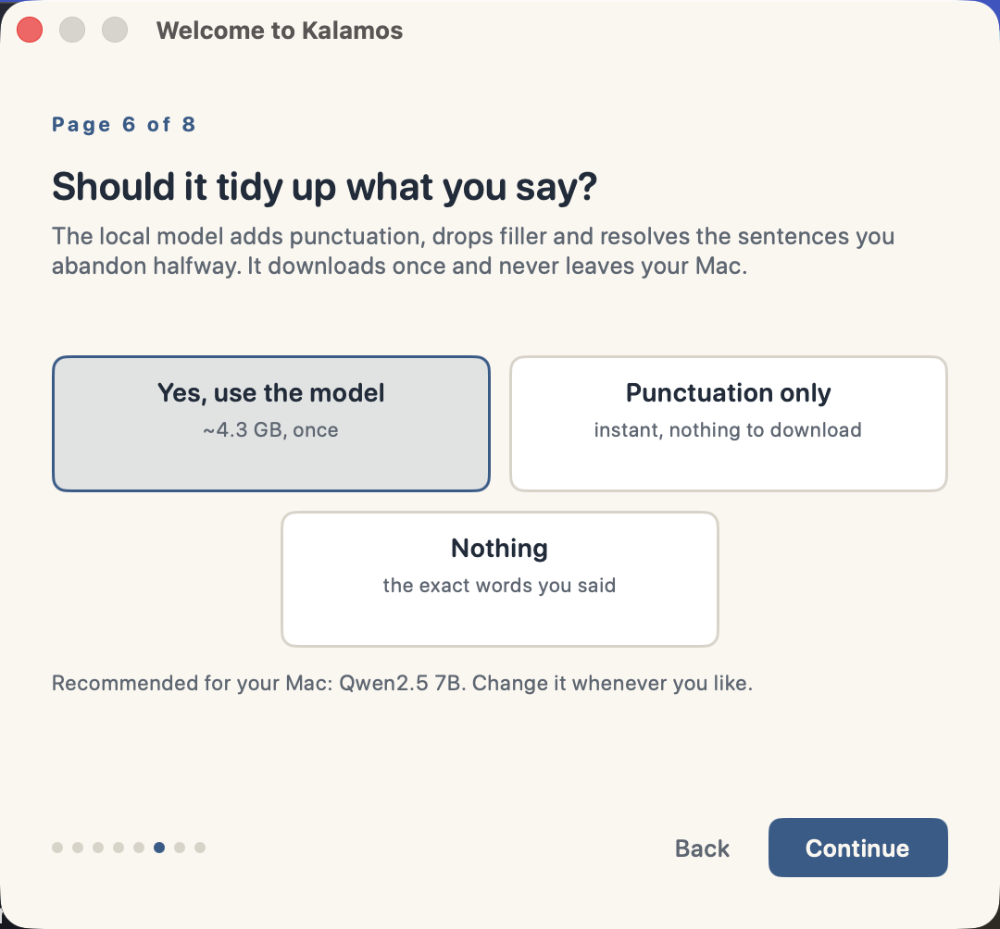
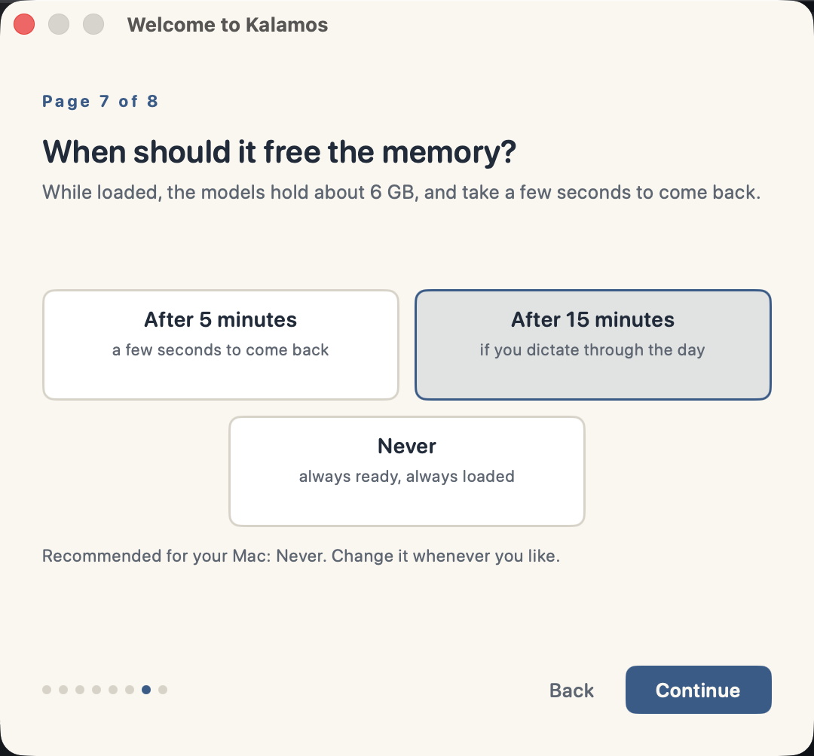

# The three engines, and the models your Mac can run

## Three engines, and why you would pick each

The same words can be heard by three different engines. They are not three
qualities — two of them run the **same** Whisper large-v3-turbo weights — they are
three machines carrying a model, and the machine turns out to matter.

| Engine | What it runs | Pick it when |
|---|---|---|
| **Whisper** (WhisperKit, Core ML) | four model sizes you choose from a menu | you want to swap model size, or you are on a Mac where Core ML on the Neural Engine wins |
| **Parakeet** (FluidAudio) | one model, 461 MB | you want the smallest download and the fastest answer, and your vocabulary has no unusual names in it |
| **Whisper.cpp** (C and Metal) | the same large-v3-turbo, 1.62 GB | you want the app to learn **your** words, and you want the same audio to give the same text every time |

### Why Whisper.cpp was added

Two things the app could not do, and neither was about the app.

**Your vocabulary could only repair, never prevent.** Whisper accepts an *initial
prompt* — words handed to the decoder before it guesses. Through WhisperKit that
channel returns an empty transcription: measured on 16 real recordings, 48 times
out of 48, and it is a known upstream defect (WhisperKit issue #372, fixed in no
released tag; the package is held at 0.14.x by a dependency wall). So the word
list could only fix a mistake after it was made, and a word missing from the list
had nobody to fix it. Through whisper.cpp the channel works: terms that came out
wrong 8 times out of 8 come out right 5 times out of 5.

**And long audio drifted.** The same file, decoded eight times, gave word counts
that swung by 11 and by 31. Whisper.cpp gave 200 identical texts over 200 passes
of the same five files. If you have ever watched a sentence go missing from a long
dictation, that is what this fixes.

One measured surprise, written down because it is counterintuitive: **a long
prompt damages the very words it contains.** With sixteen terms in the prompt,
`endomidollare` — present in the prompt — came out `endomi-dollare`. With three, it
came out right. So Kalamos does not hand over your whole list: it decodes once,
looks at what came back, and re-decodes with only the words that look wrong, at
most five. The second pass costs about a third of a second, and only on the
dictations that need it.

### Why you might switch back to Whisper

Whisper.cpp became the default in 1.2.0, and WhisperKit is still worth choosing for
three reasons. It has the **model picker**: whisper.cpp ships one size, turbo, and
ignores that menu the way Parakeet does, so a Mac that wants a smaller download has
somewhere to go. On short scripted clips, measured against the script, WhisperKit
came out slightly closer: 5.8% word error rate against 7.6%. And it is the engine
with the most hours behind it in this app.

Nothing is locked in: the choice is one row in **Preferences ▸ Dictation**, and
switching takes effect on your next dictation.



## Which models your Mac can run

**You do not have to work this out.** First run reads the chip, the memory, the
cores and the free disk, proposes what fits, and shows you the number that decided
each choice. Accept it and setup is two pages shorter; say *I'll choose* and every
page opens.



The cleanup model is a choice, not a requirement. Setup offers the local model, or
rule-based punctuation that costs nothing and downloads nothing, or the exact words
you said with no tidying at all.



Two models sit in memory: one that hears you, one that cleans up what you said. On
Apple Silicon both live in unified memory, shared with everything else you have
open — so what matters is your **total RAM**, and the sum of the two.

Swap either in **Preferences ▸ Dictation** and **Preferences ▸ Cleanup**.
Switching frees the old one at once and loads the new one on your next dictation.
No rebuild, no reinstall. Any MLX repo id works, not just the ones in the menu.

| Your Mac | Cleanup model it can hold | Speech model | Together |
|---|---|---|---|
| **8 GB** | up to ~2 GB | Small or Turbo | ~3 GB |
| **16 GB** | up to ~6 GB | any | ~8 GB |
| **24 GB** | up to ~10 GB | any | ~12 GB |
| **36 GB+** | up to ~20 GB | any | ~22 GB |

And it is a **peak, not a resting cost**: both models unload themselves after the
idle timeout, and come back in a few seconds when you next dictate.



The figure in that sentence is the sum of the two models **you** were just
proposed, not an average: choose punctuation-only cleanup and it drops, take the
small model on a 8 GB Mac and it drops again.

## What I would actually use

Can-run and should-run are different questions, and the second one has a
surprising answer.

| Your Mac | Cleanup | Speech |
|---|---|---|
| **8 GB** | Qwen2.5 **3B** Instruct (1.7 GB) | Turbo |
| **16 GB and up** | Qwen2.5 **7B** Instruct (4.3 GB) — **the default** | Turbo |

That is the whole recommendation. Two models, and a bigger Mac does not change it.

**Turbo, even on 36 GB.** Large v3 is not the upgrade the size suggests: on
dictation-length audio Turbo is nearly as accurate and several times faster.
Reach for Large v3 for a strong accent or a noisy room, not by reflex.

**Qwen 2.5, in 2026, on purpose — and this is not laziness about updating.**
Qwen 3, 3.5 and 3.6 all exist as MLX 4-bit builds, Kalamos loads them without
complaint, and every one of them is **worse at this particular job**. Not
marginally: measured on the same seven cases, the whole Qwen 3 line lands between
*"barely punctuates"* and *"does nothing but capitalise the first letter"*.

| Cleanup model | Size | Punctuation added to one long run-on | Recognised a name |
|---|---|---|---|
| **Qwen2.5 7B Instruct** | 4.3 GB | **7 marks** | yes |
| Qwen2.5 3B Instruct | 1.7 GB | 5 marks | yes |
| Qwen3 4B Instruct 2507 | 2.1 GB | 3 marks | no |
| Qwen3.5 4B | 3.1 GB | 1 mark | no |
| Qwen3.6 27B | 16 GB | 1 mark | no |

A 27B model losing to a 3B is not a capability gap, it is a mismatch. The Qwen3
family is trained to reason before answering, and this task wants the opposite: no
deliberation, just the same sentence with punctuation. *(That is the likely
explanation, not a proven one — the pinned mlx-swift version may also simply
mishandle their chat template.)*

The lesson generalises: **newer is not better, measured is better.** Run the
comparison yourself before believing this table — it is one command per model:

```sh
Kalamos --selftest-punct --model mlx-community/Qwen2.5-3B-Instruct-4bit
```

**Or no model at all.** *Cleanup ▸ Rule-based (instant)* uses none: spoken
punctuation commands, filler removal, capitalisation. Zero RAM, zero wait. You give
up the self-corrections, which are the part worth having.


## Memory, on your terms

The two models are the whole cost of running Kalamos, and you decide whether you
pay it continuously or on demand.

**Unload after a while** *(default: 5 minutes)* — the models free their memory when
you stop dictating, and are read back from disk next time, which costs a few
seconds. Between dictations Kalamos holds almost nothing.

**Or keep them resident** — **Preferences ▸ Advanced ▸ Never**. Both models are
then loaded at launch and stay loaded, so the first dictation of the session is as
fast as the tenth, at the price of the RAM staying occupied.

**And a ceiling nobody thinks to check.** MLX keeps a cache of freed Metal
buffers to reuse them, and its default limit is the *memory limit* — measured on
a 36 GB Mac: **35 020 MB**. Dictations of different lengths keep asking for
buffers of different sizes, so that cache only grows. A Kalamos left running all
day reached a **13 GB footprint** (12 GB of it in IOAccelerator, across 2391
regions) while the same binary restarted two minutes earlier sat at 4.9 GB with
1007 regions — same models, same settings, 7.5 GB of pure accumulation. Nothing
ever emptied it, and choosing "never free the memory" guaranteed nothing ever
would.

It is capped at 512 MB now, once, at startup. What that cost, measured properly —
two replicates, arms **alternated** A,B,A,B over 8 rounds of 5 dictations at
temperature 0 so both arms generate the identical tokens:

| | uncapped | capped |
|---|---|---|
| Generation time | baseline | **−0.44% and −0.72%** (noise band: 6.6% and 13.6%) |
| Buffer cache | 1608 MB | **511 MB** |
| Footprint after 40 generations | 5946 MB | **4844 MB** |

No measurable cost, 1.1 GB back almost immediately. Worth writing down: the
*first* attempt at this measurement ran the arms in blocks (A,A,B,B) and reported
the cap was "15% slower" — that was thermal drift, dumped entirely on whichever
arm ran last. If you re-measure anything here, alternate the arms.

Anything in between: 1, 2, 5, 10, 15 or 30 minutes. And if you have no idea which
to pick, `Scripts/analyze-idle.ts` reads the timestamp-only usage log and tells you
what your actual dictation rhythm implies:

```sh
bun Scripts/analyze-idle.ts
```

