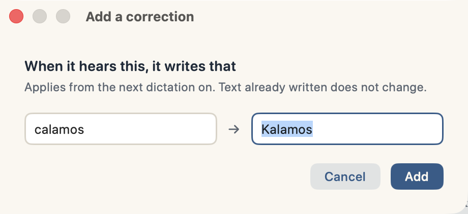

# Using Kalamos

## What macOS will say, and why

Kalamos is **not notarized**. Notarization means enrolling in the Apple Developer
Program at $99 a year, and this is a free MIT project — so the honest thing is to
tell you exactly what that costs you, rather than hide it.

macOS puts a *quarantine* flag on anything downloaded from the internet. On a
quarantined app that Apple has not notarized, Gatekeeper does not offer you a
choice: on recent macOS you get **"Kalamos is damaged and can't be opened"**,
which is not true — it is what macOS says when an app is unsigned-by-Apple and
still carries that flag.

**The one-line installer clears the flag for you** (`xattr -d
com.apple.quarantine`), which is why it exists. Piping a script from the internet
into a shell is exactly the habit that gets people compromised, so
[read it first](Scripts/install.sh) — it is about a hundred lines and it does
nothing clever.

**If you prefer to download the `.zip` from [Releases](../../releases) by hand**,
do the same thing yourself:

```sh
unzip Kalamos.zip -d /Applications
xattr -d com.apple.quarantine /Applications/Kalamos.app
open /Applications/Kalamos.app
```

**Then macOS asks for two permissions, and both are the app working, not the app
overreaching:**

- **Microphone** — to hear you. Nothing else uses it.
- **Accessibility** — two jobs: noticing the key you press *while you are in
  another app* (that is what a global hot key is), and typing the text into that
  app. Without it, pressing the key does nothing at all — no error, no sound, no
  effect. Setup asks for both with the reason next to each.

If it ever misbehaves, **Preferences ▸ Advanced ▸ Diagnostics…** prints exactly
which of those is missing.

## Using it

1. Click into any text field.
2. **Hold Right Command**, speak, release. The text appears at your cursor.
3. Or **double-tap** it to go hands-free, and tap again to stop.
4. Changed your mind halfway through? **Press Escape** and the recording is
   discarded — nothing is transcribed, nothing is typed. Escape behaves normally
   whenever Kalamos is not recording, so it stays yours everywhere else.

Everything you *do* lives in the menu-bar icon; everything you *decide* lives in
**Preferences** (⌘, from the icon), in four sections — Dictation, Cleanup, Words &
corrections, Advanced. Kalamos speaks Italian, English and French, and the
language you pick on the first screen is the language of the whole app, menu
included.

| | |
|---|---|
| **Languages** | Italian, English, French — detected automatically |
| **AI cleanup** | punctuation, filler, false starts, self-corrections — on device |
| **Translation** | dictate in one language, type in another |
| **Edit Mode** | select text, hold a key, say "make it more formal" — it rewrites in place |
| **Vocabulary** | teach it names and jargon it keeps getting wrong |
| **Corrections** | hard rules: "when you hear X, write Y" |
| **Tone** | adapts register to the app you are writing into |
| **Models** | swap the speech and cleanup models in Preferences — the first one is chosen for your Mac |
| **Prompt** | replace the cleanup instructions with your own |
| **Memory** | keep the models resident, or let them unload after N minutes — your call |
| **History** | the last 25 transcriptions, one click to copy any of them back |

First run downloads the two models — between 3.4 and 6 GB depending on which
cleanup model your Mac was given — with a progress panel that says so while it
happens. After that, nothing: no network, no account, no subscription.

**You are not asked what your Mac can take.** Nobody installing a dictation app
knows how much RAM they have, and nobody who does knows what changes between a
3B and a 7B. So setup reads the machine — chip, memory, cores, free disk — and
proposes four settings from it: which engine listens, whether the cleanup model
runs at all, which one, and when the memory is freed. Every proposal is shown
with the number that decided it, on a page called **Your Mac**. Say *that's fine*
and setup skips the two pages it just answered; say *I'll choose* and they open
with the proposal already selected.

Three rules that page keeps:

- **It shows facts, never predictions.** The seconds quoted elsewhere in this app
  were measured on one machine; printing them next to somebody else's would be
  inventing them. So every reason is a quantity read off your Mac.
- **It never proposes a model nobody measured.** The Qwen2.5 14B and Whisper
  Large v3 are real choices in Preferences and have never been benchmarked here.
- **Nothing is written unless you press a button.** Open setup, read the page,
  close it, and every setting is where you left it.

If the disk cannot hold what the memory could have run, the proposal steps down
on its own and says why — a first run that ends in a failed download is not a
first run.

## Edit Mode — rewriting what is already there

Dictation puts new words in. Edit Mode changes words that already exist: **select
any text, hold the Edit key, say what you want done to it**, and the selection is
replaced. On device, like everything else.

```
select:  hey so i can't do tomorrow's shift sorry
say:     make it more formal
get:     I regret to inform you that I will not be able to attend tomorrow's shift.

select:  we need to fix the login bug update the docs and ship the release by friday
say:     turn it into bullet points
get:     - fix the login bug
         - update the docs
         - ship the release by friday
```

It also translates, shortens, expands, changes tone — whatever you can say in a
sentence. It is **off by default** and lives on its own modifier (Fn by default,
never the dictation trigger), because "rewrite the thing I have selected" is too
destructive to trigger by accident.

Try it without granting anything:

```sh
Kalamos --edit "make it shorter" --on "your text here"
```

## Spoken punctuation, no model required

The rule-based cleanup — the free, instant one — does something the size of the
model cannot fix: it decides whether you *said* a punctuation mark or *meant* the
word.

```
ho finito il lavoro punto      →  Ho finito il lavoro.        ← a full stop
prendi il latte punto poi torna →  Prendi il latte. Poi torna. ← mid-sentence
il punto 4 è importante        →  Il punto 4 è importante.    ← still the word
vediamo il punto di vista      →  Vediamo il punto di vista.  ← still the word
```

Same four letters, four different decisions, no LLM involved. English (*"period",
"new paragraph", "question mark"*) and French (*"point", "nouveau paragraphe"*)
work the same way. `Kalamos --selftest-format` runs these as assertions.


## Translation, on device

Dictate in one language, get another out — the same local model, no service:

```
you say:  Ciao, come stai oggi? Spero che tu stia bene.
you get:  Hi, how are you today? I hope you're doing well.
```

Pick the target in **Preferences ▸ Dictation ▸ Instant translation**. Set it back to *Off* and dictation
stays in whatever language you spoke.

## Nothing is ever lost

Every transcription is recorded **before** injection is attempted, so a paste into
the wrong window or a field that stole focus cannot destroy what you said. The
menu keeps the last 25 and one click copies any of them back. Two of them are also
global shortcuts, so they work without opening anything:

- **⌃⌥C** — put the last transcription back on the clipboard.
- **⌃⌥S** — summarize the last dictation with the local model, when you have
  talked your way through a problem and want the shape of it. The summary lands on
  the clipboard too.

Control+Option rather than Command, because ⌘C belongs to macOS and an app that
swallowed it globally would break copying everywhere.

## Making it yours

Dictation degrades exactly where your work is most specific: names, jargon,
product names, foreign words. Four mechanisms handle it, and they run in this
order.


**Corrections — deterministic, always wins.** *When you hear X, write Y.* Applied
to the raw transcript before anything else touches it, whole-word and
case-insensitive. This is the right tool when Whisper gets a word wrong **the same
way every time**. Menu ▸ *Corrections ▸ Add Correction…*

**Vocabulary — contextual, applied with judgement.** A list of names, terms and
spellings injected into the cleanup model's prompt, so it preserves them when they
appear and repairs near-misses from context. This is the right tool when the
mistake **varies**. The fast path: select a word anywhere on your Mac and press
**⌃⌥L** — it is learned without opening a menu.

The difference matters. A correction is a hammer that always swings; vocabulary is
a hint the model weighs against the sentence. A surname you always want spelled one
way is a correction. A technical term Whisper mangles differently every time is
vocabulary. Both are lists you edit in **Preferences ▸ Words & corrections** —
type, add, delete.



**⌃⌥K arrives with the first half filled in.** Select the word Kalamos just got
wrong, press it, type the right one, Enter.

**Your own cleanup prompt.** **Preferences ▸ Cleanup ▸ Instructions for the
model** replaces the built-in instructions completely, so you can make it more literal, more aggressive, or
teach it a house style. Your vocabulary is still appended, whatever you write.
*Reset* puts the original back.

**Tone follows the app you are writing into.** Casual in Messages, WhatsApp,
Telegram and Slack; polite in Mail; clear and professional in Pages, Word and
Obsidian. Register only — never the meaning or your words.


## When something misbehaves

```sh
/Applications/Kalamos.app/Contents/MacOS/Kalamos --doctor
```

It checks permissions, downloaded models, the compiled Metal shaders, the trigger
key and free disk, and prints the fix for whatever is missing.

For the two privacy permissions use **Preferences ▸ Advanced ▸ Diagnostics…** instead.
macOS attributes those grants to the process that started the app, so a terminal
invocation reports your terminal's permissions rather than Kalamos's — and a
diagnostic that answers a question you did not ask is worse than none. The
command-line version says so rather than showing you a confident wrong answer.

macOS asks for two permissions on first use: **Microphone**, to hear you, and
**Accessibility**, to read the global hot key and type into other apps. Without
the second one, pressing the key does nothing at all.

